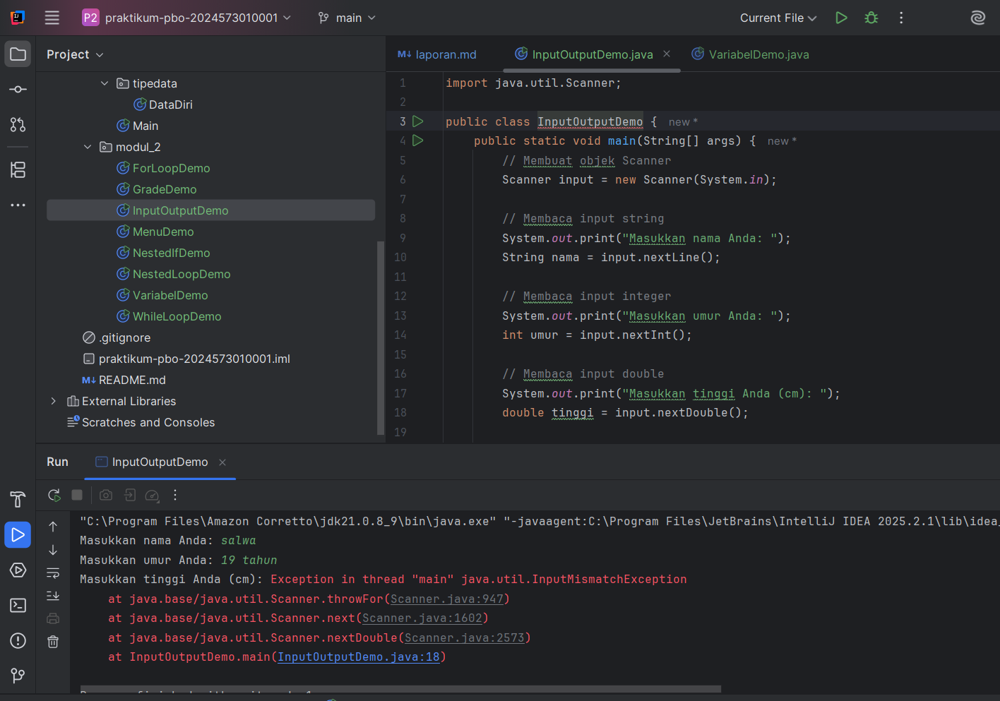
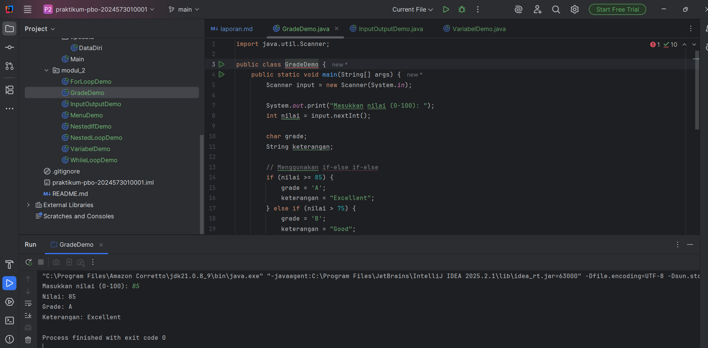
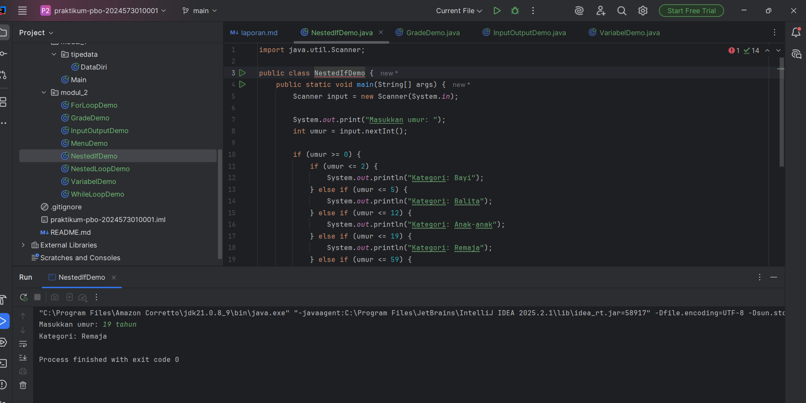
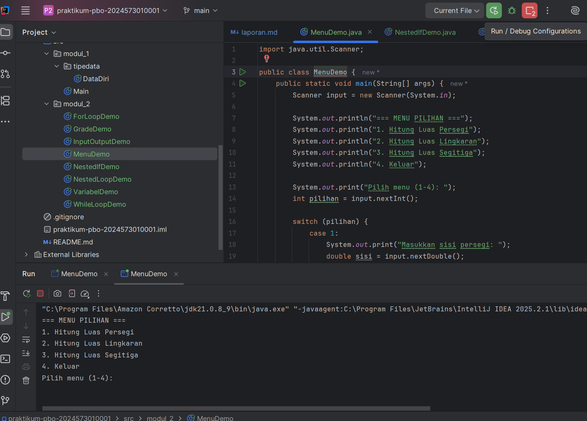
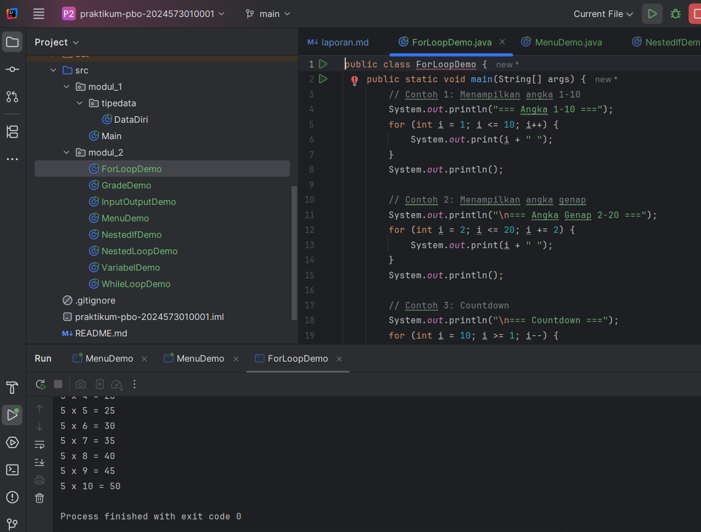
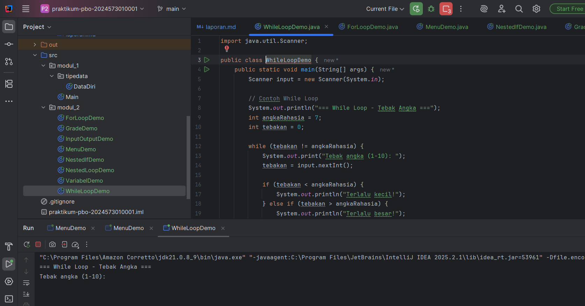
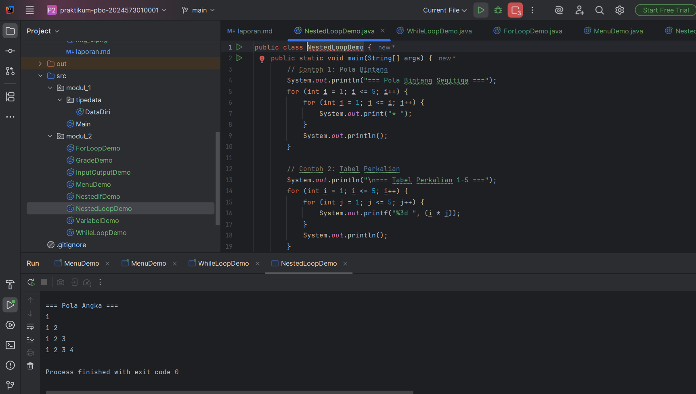

# Laporan Modul 2: Dasar Pemrograman Java
**Mata Kuliah:** Praktikum Pemrograman Berorientasi Objek   
**Nama:** [salwa]  
**NIM:** [2024573010001]  
**Kelas:** [2E]

---

## 1. Abstrak
Laporan ini berisi hasil praktikum mengenai dasar-dasar pemrograman menggunakan bahasa Java. Tujuan dari praktikum ini adalah memahami cara kerja input/output, penggunaan percabangan (if, if-else, nested-if, switch), serta perulangan (for, while, do-while, nested loop). Dengan praktikum ini, mahasiswa diharapkan mampu menulis kode Java sederhana, memahami logika dasar pemrograman, serta menganalisis output yang dihasilkan.

## 2. Praktikum
### Praktikum 1 - MODUL 2

#### Dasar Teori
Kelas Scanner digunakan untuk membaca input dari pengguna, baik berupa string, integer, maupun tipe data lainnya. Output ditampilkan menggunakan System.out.print atau System.out.println.

#### Langkah Praktikum
1. Buat file InputOutputDemo.java.
2. Ketikkan kode program untuk membaca nama, umur, dan tinggi badan.
3. Kompilasi dengan javac InputOutputDemo.java.
4. Jalankan dengan java InputOutputDemo.
#### Screenshoot Hasil

#### Analisa dan Pembahasan
Program berhasil membaca input dari pengguna dan menampilkannya kembali dalam bentuk teks yang rapi.
### Praktikum 1 - Percabangan If-Else
#### Dasar Teori
Percabangan digunakan untuk pengambilan keputusan. Struktur if-else memungkinkan program memilih satu blok kode berdasarkan kondisi tertentu.
#### Langkah Praktikum
1. Buat file GradeDemoDemo.java.
2. Ketik kode program untuk menentukan apakah sebuah angka genap atau ganjil.
3. Jalankan program.
#### Screenshoot Hasil

#### Analisa dan Pembahasan
Jika angka habis dibagi 2, program mencetak "Genap", sebaliknya mencetak "Ganjil".
Dan seterusnya......

### Praktikum 3 – Nested If
#### Dasar teori
Nested if adalah penggunaan if-else di dalam if-else lainnya untuk menangani kondisi yang lebih kompleks.

#### Langkah Praktikum
1. Buat file NestedIfDemo.java.
2. Buat program untuk mengkategorikan umur (bayi, balita, anak-anak, remaja, dewasa, lansia).
3. Jalankan program.

#### Screenshoot Hasil

#### Analisa dan Pembahasan
Program dapat menentukan kategori umur berdasarkan range yang ditentukan.

### Praktikum 4 – Switch Case
#### Dasar Teori
Switch digunakan untuk pengambilan keputusan dengan banyak pilihan.
#### Langkah Praktikum
1. Buat file MenuDemo.java.
2. Ketik kode program untuk menampilkan menu menghitung luas (persegi, lingkaran, segitiga).
3. Jalankan program dan pilih salah satu menu.

#### Screenshoot Hasil

#### Analisa dan Pembahasan
Switch case memudahkan pengelolaan banyak pilihan tanpa if-else yang panjang.

### Praktikum 5 – Perulangan For
#### Dasar Teori
Perulangan for digunakan untuk menjalankan blok kode berulang kali dengan jumlah iterasi tertentu.

#### Langkah Praktikum
1. Buat file ForLoopDemo.java.
2. Buat contoh: menampilkan angka 1-10, bilangan genap, countdown, dan tabel perkalian.
3. Jalankan program.

#### Screenshoot Hasil

#### Analisa dan Pembahasan
for efektif untuk pengulangan yang diketahui jumlah iterasinya.

### Praktikum 6 – While dan Do-While
#### Dasar Teori
While mengecek kondisi terlebih dahulu sebelum menjalankan blok kode, sedangkan do-while menjalankan blok kode minimal sekali sebelum memeriksa kondisi.

#### Langkah Praktikum
1. Buat file WhileLoopDemo.java.
2. Buat program tebakan angka dengan while loop.
3. Buat program menu dengan do-while loop.

#### Screenshoot Hasil

#### Analisa dan Pembahasan
Perbedaan utama terlihat pada do-while yang selalu mengeksekusi sekali meskipun kondisi salah.

### Praktikum 7 – Nested Loop
#### Dasar Teori
Nested loop adalah perulangan di dalam perulangan lain, sering digunakan untuk mencetak pola atau tabel.

#### Langkah Praktikum
1. Buat file NestedLoopDemo.java.
2. Buat contoh: pola segitiga bintang, tabel perkalian, pola angka.
3. Jalankan program.

#### Screenshoot Hasil

#### Analisa dan Pembahasan
Nested loop memudahkan pembuatan pola dan perhitungan berbentuk matriks atau tabel.

## 3. Kesimpulan

Dari praktikum ini dapat disimpulkan bahwa:

1. Java menyediakan berbagai struktur kontrol seperti percabangan dan perulangan.
2. if-else dan switch digunakan untuk pengambilan keputusan.
3. for, while, dan do-while digunakan untuk perulangan dengan kondisi tertentu.
4. Nested loop memungkinkan pembuatan pola atau operasi berbentuk tabel.
5. Dengan pemahaman dasar ini, mahasiswa mampu membuat program sederhana dengan logika yang lebih terstruktur.
---

## 5. Referensi

1. Oracle. Java Documentation — https://docs.oracle.com/javase/8/docs/
2. Wahana Komputer. Pemrograman Java untuk Pemula. Andi Publisher.
3. Tutorialspoint. Java Programming Tutorial — https://www.tutorialspoint.com/java
---